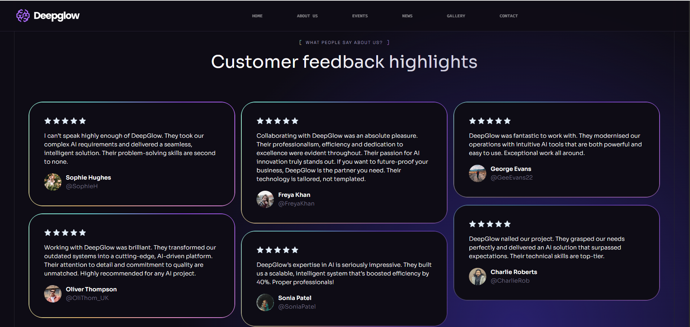

# Deepglow website

 <br/>


This website showcases a modern, responsive and fully-functional company site, for a fictional AI startup, built with React, Supabase and Tailwind CSS. It includes an admin panel, a secure login system and several dynamic pages such as Home, About Us, News, Events, Gallery and Contact.

## ✨ Features

- **Authentication & Authorization:** Secure login via Supabase; only authenticated users with admin roles can access sensitive routes.
- **Admin Management:** Admins can create new admin users (restricted functionality).
- **Dynamic Routing:** Invalid routes redirect gracefully to the homepage.
- **Session Persistence:** Sessions are stored, so users don't need to re-authenticate constantly.
- **Pages:** Includes public pages (Home, About Us, News, Events, Gallery, Contact and Login) and protected routes (Admin Panel, Register new Admin).
- **Contact & Testimonials:** Integrated contact form and testimonials management.
- **Styled with Tailwind CSS:** Custom design system using utility-first CSS framework.

## 🛠️ Technologies Used

- **React:** JavaScript library for building interactive UIs.
- **Supabase:** Backend-as-a-service platform offering authentication, database,ç and storage.
- **Tailwind CSS:** Utility-first framework for responsive and modern styling.
- **React Router**: Declarative routing library for React, enabling multi-page navigation and route protection
- **Vite:** Lightning-fast development tooling.
- **JavaScript / HTML / CSS:** Core web technologies.

## Pages Overview
### Home

#### Testimonials

### About Us

### Events

#### Event details

### News

#### News details

### Gallery

### Contact

### Login

### Admin Pannel
#### Superadmin View


#### Admin View

### Register

  
## 📦 Installation
To run this project locally, you'll need to have **Node.js** installed on your machine. Follow the steps below to get started:

1. Clone this repository:
   ```
   git clone https://github.com/CrisCorreaS/deepglow-ai-startup-website.git
   ```
2. Navigate into the project directory:
   ```
   cd portfolio.dev
   ```
3. Install the necessary dependencies:
   ```
   npm install
   ```
4. Create a [Supabase](https://supabase.com/dashboard/org/) project

5. Add a .env file in the root of your repository with these Supabase variables:
   ```
   VITE_SUPABASE_PROJECT_URL
   VITE_SUPABASE_ANON_KEY
   ```

6. In Supabase allow Authentication and create the following tables:
- **contact_messages**

  | Name | Format | Type |
  |------|--------|------|
  | id	| bigint | number |
  | created_at	| timestamp with time zone | string |
  | name	| text | string |
  | email	| text | string |
  | phone	| text | string |
  | company	| text | string |
  | country	| text | string |
  | job_title	| text |string |
  | message	| text | string |

- **testimonials**

  | Name | Format | Type |
  |------|--------|------|
  | id	| bigint | number | 
  | created_at | timestamp with time zone | string | 
  | name	| text | string	| 
  | mentions	| text | string	| 
  | review	| text | string	| 
  | stars	| smallint | number	| 
  | img_path	| text | string |

7. Add `INSERT`, `SELECT` and `DELETE` policies in the tables
- In **contact_messages**:
  ```
  // INSERT policy: Allow all inserts
  create policy "Allow all inserts"
  on "public"."contact_messages"
  as PERMISSIVE
  for INSERT
  to authenticated
  with check (
    true
  );

  // SELECT policy: Allow select for admin
  create policy "Allow select for admin"
  on "public"."contact_messages"
  as PERMISSIVE
  for SELECT
  to public
  using (
    (auth.uid() IS NOT NULL)
  );

  // DELETE policy: Allow delete for superadmin
  create policy "Allow delete for superadmin"
  on "public"."contact_messages"
  as PERMISSIVE
  for DELETE
  to public
  using (
    (auth.uid() = 'uid superadmin value'::uuid)
  );
    
  ```
> [!NOTE]
> You have to check your superadmin UID value in the Authentication panel. In the examples where I give you `uid superadmin value`, it should be something like: '3f91c6e4-7d7b-4f8c-98a1-9b6a74e3a2f9'. Example for the DELETE policy: `(auth.uid() = '3f91c6e4-7d7b-4f8c-98a1-9b6a74e3a2f9'::uuid)`

- In **testimonials**
  ```
  // INSERT policy: Allow all inserts
  create policy "Allow all inserts"
  on "public"."contact_messages"
  as PERMISSIVE
  for INSERT
  to authenticated
  with check (
    true
  );

  // SELECT policy: Allow all selects
  create policy "Allow select for admin"
  on "public"."contact_messages"
  as PERMISSIVE
  for SELECT
  to public
  using (
    true
  );

  // DELETE policy: Allow delete for superadmin
  create policy "Allow delete for superadmin"
  on "public"."contact_messages"
  as PERMISSIVE
  for DELETE
  to public
  using (
    (auth.uid() = 'uid superadmin value'::uuid)
  );
    
  ```
> [!NOTE]
> The contact form is accessible only to admins and superadmins, but only superadmins have permission to delete submissions. In contrast, testimonials can be created and viewed by all users, while deletion rights are restricted solely to superadmins.


8. Start the development server:
   ```
   npm run dev
   ```
9.  Open your browser and visit `http://localhost:4321` to view the site locally.


## 🚀 Deployment
This portfolio can easily be deployed to various platforms such as Vercel, Netlify or any static hosting provider.

To deploy on Vercel:

- Push your repository to GitHub.
- Connect your repository to Vercel and follow the prompts to deploy.

## 🔧 Customisation
Feel free to fork and customise this repository. To make changes to the styling, you can modify the tailwind.config.js file. The site’s structure and components are modular, so you can update the layout and design easily without affecting the overall functionality.

## 🤝 Contributing
If you'd like to contribute to this project, feel free to fork the repository and submit a pull request. I welcome suggestions for improvements, new features or bug fixes.

## 📜 License
This project is licensed under the **MIT** license.
